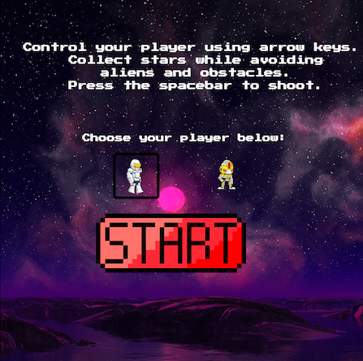
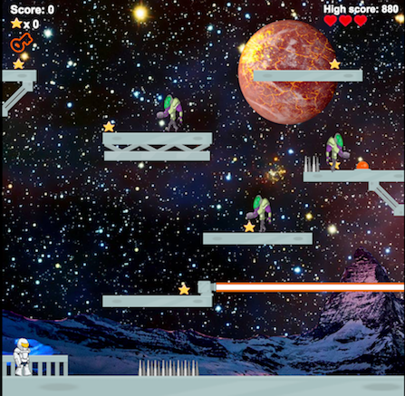
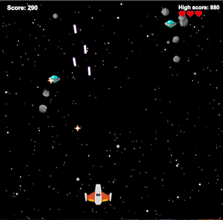
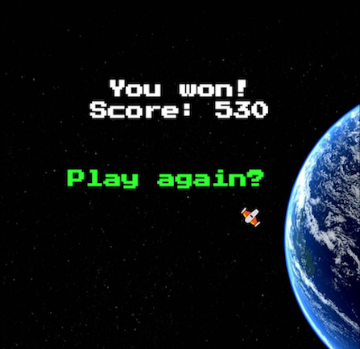
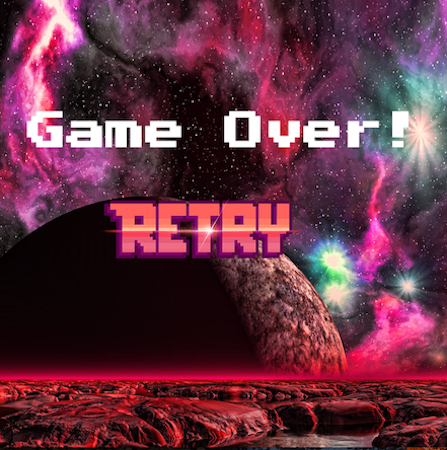

# Periapsis

### Platformer meets Asteroids Game:

#### Choose between playing an astronaut or robot character. Dodge alien enemies and obstacles while collecting stars in order to reach your spaceship, then guide your spaceship through asteroids and flying enemies home to Earth. [Play it here!](https://jbadan.github.io/platformGame/) 

 

  
  
  

----

### Technologies Used:
* JavaScript
* Phaser.io
* GIMP
* Stitches

### Issues: 
* Learning Phaser framework
* Enemy automated bullet firing on level 2 

### Unresolved Problems:
* Collision detection bugs on level 2 with enemy bullets
* Google fonts loading after text is created on first play
* Player sprites have too much padding around the image, making the collision detection more sensitive than it should be. 

### Next Steps:
* fix unresolved problems
* continue testing for bugs 
* add boss level 

### Resources: 
* http://blog.kumansenu.com/2016/04/patrolling-enemy-ai-with-phaser/
* https://hacks.mozilla.org/2017/04/html5-games-workshop-make-a-platformer-game-with-javascript/
* http://kenney.nl/
* https://tutorialzine.com/2015/06/making-your-first-html5-game-with-phaser
* https://draeton.github.io/stitches/
* https://opengameart.org/
